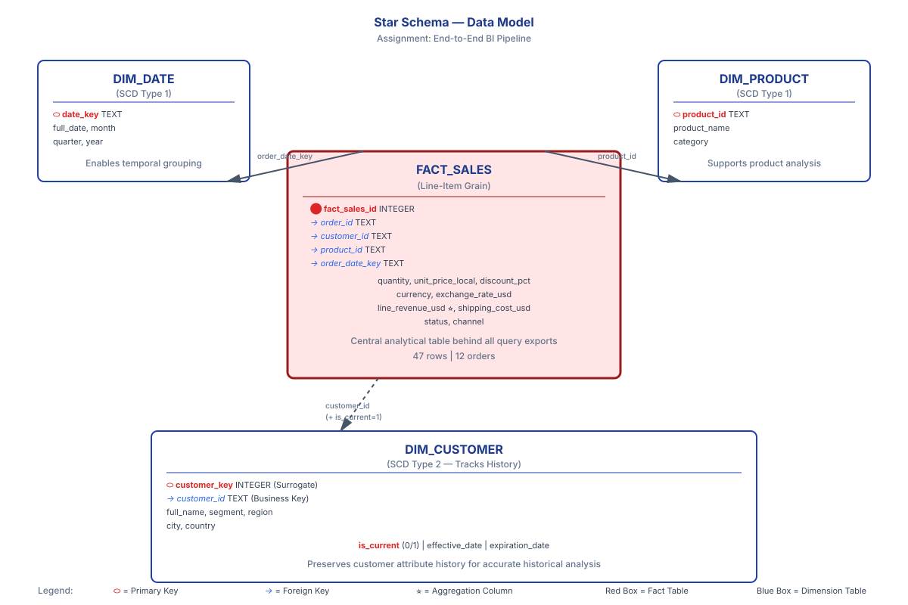

# Assignment — End-to-end Plan & Repo

This repository contains the completed pipeline, analytical exports, and dashboard assets for the assessment.

## Implementation decisions
- Database: SQLite 3 (`assignment.db`) for portability and simple Power BI connectivity.
- Dashboard: Static site in `site/index.html` with Plotly.js charts driven by CSV exports and published by GitHub Pages Actions.
- Currency conversion: `1 EUR = 1.08 USD`; shipping costs in EUR are normalized to USD.
- SCD strategy: **SCD Type 2** for `dim_customer` to preserve customer history.

---

## Data Model

📊 **Star Schema Architecture**

See [Data Model Documentation](docs/DATA_MODEL.md) for the complete schema specification.

**Visual Diagram:**


**Key Tables:**
- **FACT_SALES** (central fact table, line-item grain)
  - Links to dim_date, dim_product, dim_customer, and implicitly channel
  - 47 line items across 12 orders
  
- **DIM_DATE** (SCD Type 1)
  - Temporal dimensions for analysis (month, quarter, year)
  
- **DIM_PRODUCT** (SCD Type 1)
  - Product details and category
  
- **DIM_CUSTOMER** (SCD Type 2)
  - Tracks customer segment, region, and contact changes over time
  - Enables historical "as-of" queries and accurate revenue attribution

---

## dbt-style model for fact_sales

If this were implemented in dbt, the equivalent model would keep the same grain as the SQLite fact table: one row per order line item.

```sql
with source as (

    select
        order_id,
        customer_id,
        product_id,
        order_date_key,
        quantity,
        unit_price_local,
        line_revenue_usd,
        shipping_cost_usd,
        status,
        channel
    from {{ source('raw', 'fact_sales') }}

),

final as (

    select
        {{ dbt_utils.generate_surrogate_key([
            'order_id',
            'product_id',
            'customer_id',
            'order_date_key'
        ]) }} as fact_sales_id,

        order_id,
        customer_id,
        product_id,
        order_date_key,

        quantity,
        unit_price_local,
        line_revenue_usd,
        shipping_cost_usd,

        status,
        channel,

        line_revenue_usd + shipping_cost_usd as total_order_line_value_usd

    from source
)

select *
from final
```

### Why this is the right grain
- Each fact row represents a single product line within an order.
- This preserves transactional detail for revenue, quantity, and channel analysis.
- Aggregations such as monthly revenue, product revenue, or segment/channel totals can be built cleanly in downstream marts and BI layers.

### Equivalent SQL version
```sql
SELECT
    ROW_NUMBER() OVER (
        ORDER BY order_id, product_id, customer_id, order_date_key
    ) AS fact_sales_id,
    order_id,
    customer_id,
    product_id,
    order_date_key,
    quantity,
    unit_price_local,
    line_revenue_usd,
    shipping_cost_usd,
    status,
    channel,
    line_revenue_usd + shipping_cost_usd AS total_order_line_value_usd
FROM fact_sales;
```

---

## Q-A: CUST-1042 'Sarah Mitchell' appears in 3 orders. Look carefully at her data across those orders — something changes. How would you handle this in your model, and what are the trade-offs of your approach?

### Q-A: How would you handle slowly changing dimensions in this model?

**Answer:**

We implemented **SCD Type 2** for the `dim_customer` table to preserve the full history of customer attributes while enabling accurate historical analysis.

**Why SCD Type 2?**

1. **Business Requirement:** Customers transition between segments (e.g., SMB → Enterprise) as their business grows. Understanding historical segment affiliation is critical for trend analysis.

2. **Accurate Reporting:** When analyzing "Q2 revenue by customer segment," we need to use the segment value that was *active during Q2*, not the current segment. Without SCD Type 2, past reports would be retroactively rewritten.

3. **Auditability:** Every change is timestamped with `effective_date` and `expiration_date`, providing a complete audit trail.

**Implementation:**

```sql
-- DIM_CUSTOMER structure with SCD Type 2
CREATE TABLE dim_customer (
    customer_key INTEGER PRIMARY KEY,      -- Surrogate key (tracks versions)
    customer_id TEXT,                      -- Business key (customer ID)
    full_name TEXT,
    segment TEXT,                          -- Dimension attribute
    region TEXT,
    city TEXT,
    country TEXT,
    is_current INTEGER DEFAULT 1,          -- 1 = active, 0 = historical
    effective_date TEXT,                   -- Start date of this version
    expiration_date TEXT                   -- End date (NULL = current)
);
```

**Example:** Customer segment upgrade
```
customer_key | customer_id | segment      | is_current | effective_date | expiration_date
1            | CUST-001    | SMB          | 0          | 2023-01-15     | 2024-06-30
2            | CUST-001    | Enterprise   | 1          | 2024-07-01     | NULL
```

**Query Impact:**

```sql
-- Current segment (standard report)
SELECT customer_id, segment
FROM dim_customer
WHERE is_current = 1;

-- Historical as-of Q2 2024
SELECT customer_id, segment
FROM dim_customer
WHERE effective_date <= '2024-06-30' AND (expiration_date IS NULL OR expiration_date > '2024-06-30');
```

**When Would We Use SCD Type 1 or Type 3?**
- **SCD Type 1:** For attributes that don't need history (e.g., product category corrections, data corrections). Simpler, but loses history.
- **SCD Type 3:** If we only need to compare current vs. previous value (e.g., "previous_segment"). Less storage than Type 2, but limited history depth.

---

## Question B: Incremental Load Strategy

### Q-B: How would you design an incremental load for this pipeline?

**Answer:**

An incremental load strategy would replace the current full-reload approach with a **change-data-capture (CDC) and delta-merge pattern** to handle recurring data syncs efficiently.

**Current State (Full Load):**
- Every run: Delete all tables → Re-extract JSON → Re-load into SQLite
- Pros: Simplicity, consistency, full re-validation
- Cons: Inefficient for large datasets; loses performance advantage of incremental updates

**Proposed Incremental Strategy:**

**1. Extract Phase: Change Detection**

```python
# Pseudo-code: incremental extract
def extract_new_orders(last_sync_timestamp):
    """Only fetch orders modified since last run."""
    new_orders = [o for o in orders if o['updated_at'] > last_sync_timestamp]
    updated_orders = [o for o in orders if o['updated_at'] > last_sync_timestamp and o['id'] in existing_ids]
    return new_orders, updated_orders
```

**Implementation:**
- Add a `last_sync_timestamp` checkpoint file (`checkpoints/last_sync.txt`)
- Call ERP API with `?updated_since=<timestamp>` filter (if available)
- Parse only new/modified orders from `orders_raw.json`

**2. Load Phase: Upsert Logic**

```sql
-- Upsert fact_sales (replace if exists, insert if new)
INSERT INTO fact_sales (order_id, customer_id, ..., line_revenue_usd)
SELECT order_id, customer_id, ..., line_revenue_usd
FROM staged_orders
ON CONFLICT(order_id) DO UPDATE SET
    status = excluded.status,
    line_revenue_usd = excluded.line_revenue_usd,
    updated_at = datetime('now');
```

**Key Points:**
- Use `ON CONFLICT` (SQLite) or `MERGE` (SQL Server) to idempotently handle retries
- Only update fields that may have changed (status, shipping cost)
- Preserve historical fact records for audit

**3. Dimension Phase: SCD Type 2 for Customers**

```sql
-- Handle customer segment changes
UPDATE dim_customer
SET is_current = 0, expiration_date = datetime('now')
WHERE customer_id = ? AND segment != ? AND is_current = 1;

INSERT INTO dim_customer (customer_id, segment, ..., is_current, effective_date)
VALUES (?, ?, ..., 1, datetime('now'));
```

**4. Checkpoint & Recovery**

```python
# After successful load, record sync checkpoint
def mark_sync_complete():
    with open('checkpoints/last_sync.txt', 'w') as f:
        f.write(datetime.utcnow().isoformat())
```

**5. Scheduling**

```yaml
# Example: Nightly incremental sync (cron or GitHub Actions)
schedule:
  - cron: "0 2 * * *"  # 2 AM daily
  run:
    - python scripts/incremental_etl.py
    - python scripts/run_queries.py
```

**Benefits:**
- ✅ **Speed:** Only process changed rows (minutes vs. full reload)
- ✅ **Volume:** Scales to millions of orders without full re-validation
- ✅ **Accuracy:** SCD Type 2 preserves change history
- ✅ **Resilience:** Idempotent upserts allow safe retries on failure
- ✅ **Cost:** Reduced compute; fewer redundant transformations

**Trade-offs:**
- ⚠️ More complex logic (must handle partial failures, state management)
- ⚠️ Requires API timestamp support or transaction logs from ERP
- ⚠️ Checkpoint state must be carefully managed (don't lose sync position)

---

---

## Quick Start

1. **Create and activate a virtual environment:**
```powershell
python -m venv .venv
.venv\Scripts\Activate.ps1
python -m pip install -r requirements.txt
```

2. **Run the pipeline in order:**
```powershell
python scripts/create_schema.py
python scripts/etl.py orders_raw.json
python scripts/build_dimensions.py
python scripts/run_queries.py
```

3. **Optional dashboard images:**
```powershell
python scripts/generate_dashboards.py
```

4. **View the dashboard locally:**
```powershell
python -m http.server 8000 --directory site
```
Open http://localhost:8000 in a browser.

5. **View the published site:**
The GitHub Actions workflow copies `exports/*.csv` into `site/exports/` and publishes `site/` to GitHub Pages. If you fork this repository, update the remote CSV URL in `site/index.html` to match your GitHub Pages repository.

---

## Data Quality

See [Data Quality Log](data_quality_log.md) for detailed findings:
- **6 quality issues identified** across ETL and dimension build steps
- All issues are logged with root cause and resolution strategy
- Issues: category casing drift, conflicting product categories, missing price data, duplicate line items, currency/shipping normalization, discount handling

---

## Submission Structure

```
.
├── orders_raw.json                 # Raw ERP export (provided, unmodified)
├── assignment.db                   # SQLite database created by the pipeline
├── README.md                       # This guide plus the assignment answers
├── data_quality_log.md             # Logged data-quality findings and handling
├── DEPLOY.md                       # GitHub Pages deployment notes
├── CHAT_SESSION_FULL.md            # Full transcript of the AI-assisted session
├── CHAT_SESSION.md                 # Shorter session summary
├── docs/
│   ├── DATA_MODEL.md               # Schema specification and design rationale
│   └── star_schema_diagram.svg     # Visual ER diagram
├── scripts/
│   ├── create_schema.py            # Create the SQLite schema
│   ├── etl.py                      # Normalize and load raw orders
│   ├── build_dimensions.py         # Build dimensions and enrich the fact table
│   ├── run_queries.py              # Execute the 4 analytical SQL queries
│   └── generate_dashboards.py      # Generate PNG dashboard mockups
├── exports/
│   ├── monthly_revenue.csv         # Query 1: Monthly revenue
│   ├── top_products.csv            # Query 2: Top products
│   ├── revenue_by_segment_channel.csv  # Query 3: Segment × channel
│   └── customer_rank.csv           # Query 4: Customer ranking
├── site/
│   └── index.html                  # Plotly dashboard that loads the CSV exports
├── .github/workflows/
│   └── deploy.yml                  # GitHub Actions workflow for GitHub Pages
└── requirements.txt                # Python dependencies
```

---

## AI Usage Declaration

**Tools Used:**
- GitHub Copilot — code drafting and completion
- Claude / ChatGPT — ETL design consultation, SQL query structure
- Gemini — initial project architecture planning

**What AI Produced:**
- Starter ETL skeleton (extraction logic, schema setup)
- SQL query templates (GROUP BY aggregations, window functions)
- README and documentation structure
- Dashboard HTML scaffold with Plotly integration

**Manual Verification:**
All AI-assisted content was:
1. **Reviewed** for correctness and business logic
2. **Tested** against sample data (orders_raw.json)
3. **Refined** with manual adjustments for currency conversion, SCD Type 2 logic, data quality handling
4. **Validated** through export CSV inspection and dashboard rendering

The full transcript of the AI-assisted work is stored in [CHAT_SESSION_FULL.md](CHAT_SESSION_FULL.md).

**Key Decisions Made by Engineer:**
- Choice of SQLite over cloud database (portability)
- SCD Type 2 implementation pattern (preserves history)
- EUR→USD conversion rate (1:1.08)
- Deduplication strategy for duplicate line items
- GitHub Pages deployment architecture

---

## Notes & Known Limitations

- **Full Reload Pipeline:** The current scripts rebuild the database and exports from the raw JSON source each run.
- **Test Data:** Submission uses 12 sample orders (47 line items) from provided JSON.
- **Scaling:** Schema is designed to scale to millions of rows; tested locally with SQLite 3.
- **Dimensions:** `build_dimensions.py` writes `fact_sales_enriched` with a `customer_key` lookup for SCD Type 2 history, while `fact_sales` remains the canonical fact table.

---

## Questions?

Refer to:
- **Data Model:** [docs/DATA_MODEL.md](docs/DATA_MODEL.md)
- **Quality Issues:** [data_quality_log.md](data_quality_log.md)
- **Deployment:** [DEPLOY.md](DEPLOY.md)
- **Chat History:** [CHAT_SESSION_FULL.md](CHAT_SESSION_FULL.md)
