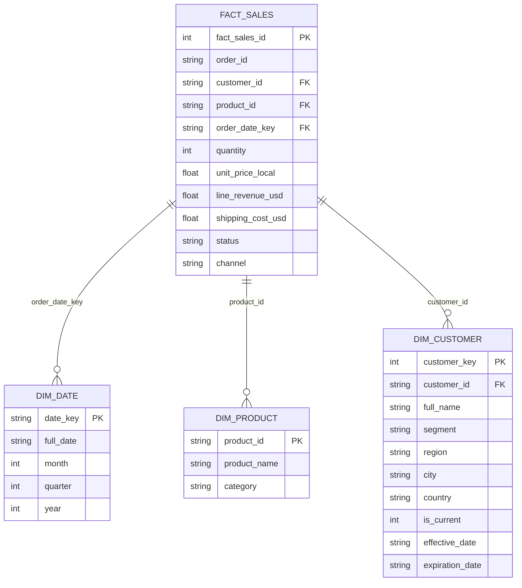

# Data Model — Star Schema Architecture

## Overview

This assignment uses a **star schema** data model optimized for analytical queries. The schema centers on a fact table (`fact_sales`) connected to four dimension tables that provide rich business context.

---

## Entity Relationship Diagram



---

## Table Specifications

### **FACT_SALES** (Central Fact Table)
**Grain:** Line item (one row per product line per order)

| Column | Type | Description |
|--------|------|-------------|
| `fact_sales_id` | INTEGER | Surrogate key (auto-increment) |
| `order_id` | TEXT | Foreign key to order (business key) |
| `customer_id` | TEXT | Foreign key to `dim_customer` |
| `product_id` | TEXT | Foreign key to `dim_product` |
| `order_date_key` | TEXT | Foreign key to `dim_date` (YYYY-MM-DD) |
| `quantity` | INTEGER | Units ordered |
| `unit_price_local` | REAL | Unit price in order currency |
| `line_revenue_usd` | REAL | Total line revenue in USD (normalized) |
| `shipping_cost_usd` | REAL | Shipping cost in USD |
| `status` | TEXT | Order status (e.g., 'Delivered', 'Pending') |
| `channel` | TEXT | Sales channel (e.g., 'Online', 'Retail') |

**Sample Query:**
```sql
SELECT COUNT(*) FROM fact_sales;  -- 47 line items across 12 orders
```

---

### **DIM_DATE** (Date Dimension)
**Grain:** One row per date  
**Type:** Slowly Changing Dimension — Type 1 (no history tracking)

| Column | Type | Description |
|--------|------|-------------|
| `date_key` | TEXT | Date in YYYY-MM-DD format (PK) |
| `full_date` | TEXT | Full date string |
| `month` | INTEGER | Month number (1–12) |
| `quarter` | INTEGER | Quarter (1–4) |
| `year` | INTEGER | Calendar year |

**Purpose:** Enables drill-down analysis by temporal dimensions.

---

### **DIM_PRODUCT** (Product Dimension)
**Grain:** One row per product  
**Type:** Slowly Changing Dimension — Type 1

| Column | Type | Description |
|--------|------|-------------|
| `product_id` | TEXT | Product identifier (PK) |
| `product_name` | TEXT | Human-readable product name |
| `category` | TEXT | Product category (e.g., 'Electronics') |

**Sample:** `PROD-001 | Laptop Pro | Electronics`

---

### **DIM_CUSTOMER** (Customer Dimension)
**Grain:** One row per customer version (SCD Type 2)  
**Type:** Slowly Changing Dimension — Type 2 (tracks history)

| Column | Type | Description |
|--------|------|-------------|
| `customer_key` | INTEGER | Surrogate key for tracking history (PK) |
| `customer_id` | TEXT | Business key (customer ID in ERP) |
| `full_name` | TEXT | Customer name |
| `segment` | TEXT | Customer segment (e.g., 'Enterprise', 'SMB') |
| `region` | TEXT | Geographic region |
| `city` | TEXT | City name |
| `country` | TEXT | Country name |
| `is_current` | INTEGER | 1 = current record, 0 = historical |
| `effective_date` | TEXT | Date when this version became effective |
| `expiration_date` | TEXT | Date when this version expired (NULL = current) |

**SCD Type 2 Example:**

If a customer's segment changes from "SMB" to "Enterprise":

```
customer_key | customer_id | full_name    | segment      | is_current | effective_date | expiration_date
1            | CUST-001    | Acme Corp    | SMB          | 0          | 2023-01-15     | 2024-06-30
2            | CUST-001    | Acme Corp    | Enterprise   | 1          | 2024-07-01     | NULL
```

This allows historical queries to reproduce past fact tables and analysis.

---

## Relationships & Foreign Keys

| Relationship | FK Table | PK Table | Join Condition |
|--------------|----------|----------|-----------------|
| Sales → Date | `fact_sales.order_date_key` | `dim_date.date_key` | Enables temporal grouping |
| Sales → Product | `fact_sales.product_id` | `dim_product.product_id` | Enables product analysis |
| Sales → Customer | `fact_sales.customer_id` | `dim_customer.customer_id` | Enables customer analysis (current snapshot) |

**Note:** For SCD Type 2 queries, join on `dim_customer.customer_id AND dim_customer.is_current = 1` to get the current customer attributes.

**Implementation note:** `build_dimensions.py` also writes `fact_sales_enriched`, which adds a `customer_key` lookup for SCD-aware joins. The logical star schema remains centered on `fact_sales`, but the enriched table is used to make historical customer reporting easier in SQLite.

---

## Design Rationale

### **Why Star Schema?**
- **Simplicity:** Single fact table with denormalized dimension lookups
- **Performance:** Minimal joins for common queries
- **Scalability:** Easy to add new dimensions or facts
- **BI-Ready:** Natural fit for Power BI, Tableau, Looker, etc.

### **Why SCD Type 2 for Customers?**
- **Business requirement:** Track segment changes (e.g., SMB → Enterprise)
- **Historical accuracy:** Reproduce sales figures by segment for past periods
- **Auditability:** Full history of customer attribute changes with effective dates

### **Why Line-Item Grain for Facts?**
- **Flexibility:** Supports aggregation at order, product, customer, and date levels
- **Detail:** Preserves individual line-item pricing and shipping costs
- **Normalization:** Avoids double-counting when orders have multiple line items

### **Currency Normalization (EUR → USD)**
- **Conversion rate:** 1 EUR = 1.08 USD
- **Applied to:** `unit_price_local` (source) → `line_revenue_usd` (normalized)
- **Storage:** Shipping costs stored as `shipping_cost_usd` to match fact granularity

---

## Key Queries Supported

This schema enables efficient answers to:

1. **Monthly revenue trends** — Group `fact_sales` by `dim_date.month`
2. **Top products by revenue** — Group `fact_sales` by `dim_product`, order by SUM(line_revenue_usd)
3. **Revenue by segment & channel** — Group `fact_sales` by `dim_customer.segment` and `channel`
4. **Customer ranking** — Group `fact_sales` by `customer_id`, rank by total revenue

See `scripts/run_queries.py` for SQL implementations.

---

## Related Files

- **Schema creation:** `scripts/create_schema.py`
- **Data load:** `scripts/etl.py`
- **Queries:** `scripts/run_queries.py`
- **Data quality:** `data_quality_log.md`
- **Implementation diagram:** `docs/implementation_schema.svg`

---

## Implementation Notes

The scripts create a few helper tables in addition to the logical star schema:

- `orders` is created by `scripts/create_schema.py` as a source/staging table.
- `orders_staging` and `order_lines_staging` are temporary load tables written by `scripts/etl.py`.
- `fact_sales_enriched` is written by `scripts/build_dimensions.py` to attach `customer_key` values for SCD Type 2 analysis.

These helper tables support the pipeline, but the analytical model remains the star schema documented above.
